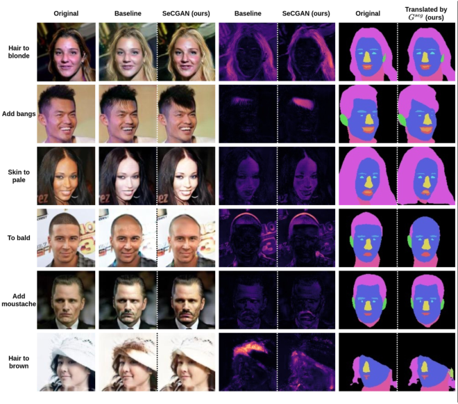

https://arxiv.org/pdf/2111.09298

作者：Jiaze Sun

单位：Imperial College London

## 摘要

近年来，语义引导条件生成对抗网络(cGANs)已成为一种流行的人脸编辑方法。然而，现有的大多数方法都将语义掩码作为直接的条件输入引入到生成器中，并且常常要求目标掩码在RGB空间中执行相应的转换。我们提出了SeCGAN，一种新的标签引导的cGAN，可以利用语义信息编辑人脸图像，而不需要指定目标语义遮罩。在训练过程中，SeCGAN有两个并行操作的生成器和判别器分支，一个用于翻译RGB图像，另一个用于语义掩码。为了将两个分支以一种互惠的方式连接起来，我们引入了一个语义一致性损失，它约束两个分支具有一致的语义输出。虽然两个分支都需要在训练期间，RGB分支是我们的主要网络和语义分支是不需要推理。我们在CelebA和CelebA- hq上的结果表明，我们的方法能够生成具有更准确属性的面部图像，在目标属性识别率方面优于竞争基准，同时保持质量指标，如自监督FID和IS。

<!--more-->

## motivation

- 这些方法之间的一个共同点是，生成输出保持在RGB域内，更高级别的信息要么通过直接输入吸收，要么以补充RGB数据的方式。

  

## contribution

- 我们提出了一个用于人脸编辑的cGAN，它采用了一个并行层次结构，在原始像素和语义水平上执行翻译。据我们所知，这是第一个纯粹在语义面具之间探索图像对图像翻译的工作。
- 我们广泛的定量评估表明，我们的方法实现了卓越的目标属性识别率(TARR)，同时能够保持质量指标，包括ssFID和IS。

- 我们的定性评价表明，我们的方法能够综合更独特和准确的属性，同时避免不必要和不相关的编辑。

## approach

### Parsing network

我们使用在CelebAMask-HQ上预先训练的现有语义分割网络来解析源图像并将RGB图像转换为语义区域。该网络针对不同的分辨率分别进行预训练，并将RGB域中的每个像素分为以下12部分:皮肤、眉毛、眼睛、眼镜、耳朵、耳环、鼻子、嘴巴、嘴唇、脖子、头发等。最后一段“others”实际上是背景、项链、帽子、衣服的结合，与面部属性操纵无关。

### RGB branch

- input RGB image $x^{in}$, target attribute labels $y^{src}$ and $y^{trg}$
- $G^{rgb}$ synthesises $x^{out}=G^{rgb}(x^{in},y^{diff})$
- $y^{diff}=y^{trg}-y^{src}$
- $D^{rgb}$ has two output $D^{rgb}_{adv}$ and $D^{rgb}_{cls}$ 分别为真实预测和属性向量。
- $$\mathcal{L}^{D^{rgb}}_{adv}=\Bbb{E}_{x^{in},y^{diff}}\left[D^{rgb}(G^{rgb}(x^{in},y^{diff})) \right]-\Bbb{E}_{x^{in}}\left[D^{rgb}(x^{in}) \right]\\ + \lambda_{gp}\Bbb{E}_{\hat{x}}\left[\left\|\nabla_{\hat{x}}D^{rgb}(\hat{x})\right\|_{2}-1 \right]$$
- $\mathcal{L}^{G^{rgb}}_{adv}=\Bbb{E}_{x^{in},y^{diff}}\left[ -D^{rgb}(G^{rgb}(x^{in},y^{diff})) \right]$
- $\hat{x}$ is uniformly sampled along straight line between $x^{in}$ and $x^{out}$
- $$\mathcal{L}_{c l s}^{D^{r g b}} =\underset{\mathbf{x}^{i n}, \mathbf{y}^{s r c}}{\mathbb{E}}-\left[\mathbf{y}^{s r c} \cdot \log \left(D_{c l s}^{r g b}\left(\mathbf{x}^{i n}\right)\right)\right.\\
  \left.+\left(\mathbf{1}-\mathbf{y}^{s r c}\right) \cdot\left(\mathbf{1}-\log \left(D_{c l s}^{r g b}\left(\mathbf{x}^{i n}\right)\right)\right)\right]$$​

- $\mathcal{L}_{c l s}^{G^{r g b}} =\underset{\mathbf{x}^{i n}, \mathbf{y}^{t r g}}{\mathbb{E}}-\left[\mathbf{y}^{t r g} \cdot \log \left(D_{c l s}^{r g b}\left(G^{r g b}\left(\mathbf{x}^{i n}, \mathbf{y}^{d i f f}\right)\right)\right)\right.\\
  \left.+\left(\mathbf{1}-\mathbf{y}^{t r g}\right) \cdot\left(\mathbf{1}-\log \left(D_{c l s}^{r g b}\left(G^{r g b}\left(\mathbf{x}^{i n}, \mathbf{y}^{d i f f}\right)\right)\right)\right)\right]$

- $\mathcal{L}_{r e c}^{r g b}=\underset{\mathbf{x}^{i n}}{\mathbb{E}}\left[\left\|\mathbf{x}^{i n}-G^{r g b}\left(\mathbf{x}^{i n}, \mathbf{0}\right)\right\|_{1}\right]$

### Semantic branch

- soft mask $\hat{s}^{in}=P\left(x^{in}\right)$ shape is [number of segments $\times$ height $\times$ width]

- output semantic mask $\hat{s}^{out}=G^{seg}\left(s^{in},y^{diff}\right)$
- output with ${\rm Softmax}\ layer$ 

- $\mathcal{L}_{r e c}^{s e g}={\mathbb{E}_{\mathbf{s}^{i n}}}\left[-\frac{1}{H W} \sum_{i, j} \mathbf{s}_{i, j}^{i n} \cdot \log \left(G^{s e g}\left(\mathbf{s}^{i n}, \mathbf{0}\right)_{i, j}\right)\right]$ 重建损失

- 其他损失和RGB分支相同

  

###  Semantic consistency

- $\left.\mathcal{L}_{s c}^{G^{r g b}}=\underset{\mathbf{s}^{o u t}, \mathbf{x}^{\text {out }}}{\mathbb{E}}\left[-\frac{1}{H W} \sum_{i, j} \mathbf{s}_{i, j}^{\text {out }} \cdot \log \left(P\left(\mathbf{x}^{\text {out }}\right)_{i, j}\right)\right)\right]$
- $\left.\mathcal{L}_{s c}^{G^{s e g}}=\underset{\text { ś }^{\text {out }}, \mathbf{x}^{\text {out }}}{\mathbb{E}}\left[-\frac{1}{H W} \sum_{i, j} \bar{P}\left(\mathbf{x}^{\text {out }}\right)_{i, j} \cdot \log \left(\hat{\mathbf{s}}_{i, j}^{\text {out }}\right)\right)\right]$
- 让RBG和semantic 分支相同，并传递信息

### Optimisation

- $\mathcal{L}^{D^{r g b}}=\mathcal{L}_{a d v}^{D^{r g b}}+\lambda_{c l s} \mathcal{L}_{c l s}^{D^{r g b}} \\$

- $\mathcal{L}^{G^{r g b}} =\mathcal{L}_{a d v}^{G^{r g b}}+\lambda_{c l s} \mathcal{L}_{c l s}^{G^{r g b}}+\lambda_{r e c} \mathcal{L}_{r e c}^{r g b}+\lambda_{s c} \mathcal{L}_{s c}^{G^{r g b}}$
- $\mathcal{L}^{D^{s e g}} =\mathcal{L}_{\text {adv }}^{D^{s e g}}+\lambda_{\text {cls }} \mathcal{L}_{\text {cls }}^{D^{s e y}} \\$

- $\mathcal{L}^{G^{s e g}} =\mathcal{L}_{\text {adv }}^{G^{s e g}}+\lambda_{c l s} \mathcal{L}_{c l s}^{G^{s e g}}+\lambda_{\text {rec }} \mathcal{L}_{\text {rec }}^{\text {seg }}+\lambda_{s c} \mathcal{L}_{s c}^{G^{s e g}}$

## experiment

## 想法

效果非常差，感觉还没有$STGAN$ 高，效果相对来说也比较差。想法倒是新颖，写作倒是看得头疼感觉是$freshman$写的。作为基础框架可以尝试一下，但效果可能不会好。如果这篇文章能发表，就离谱。

